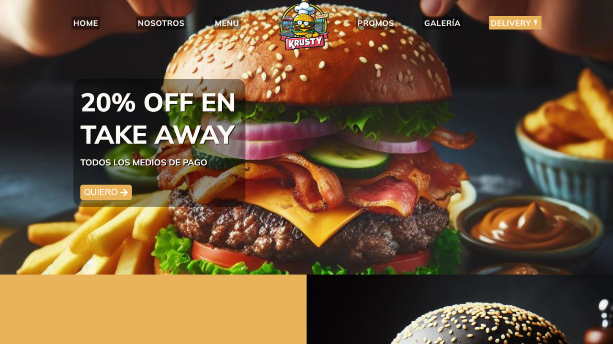
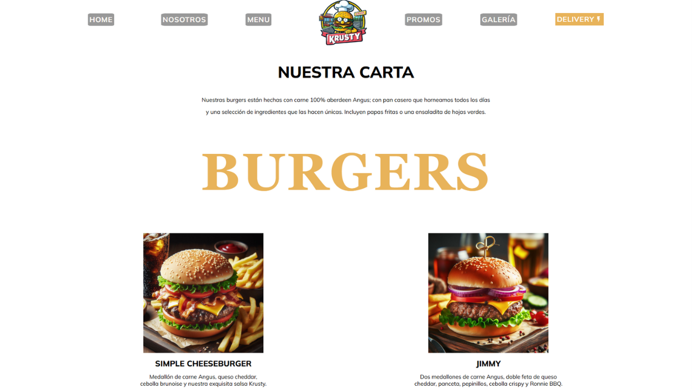
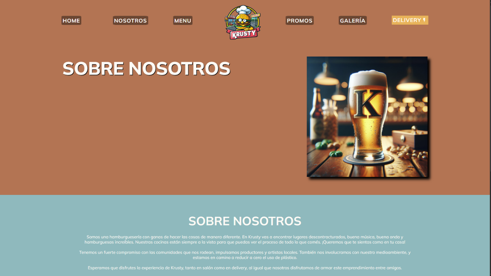
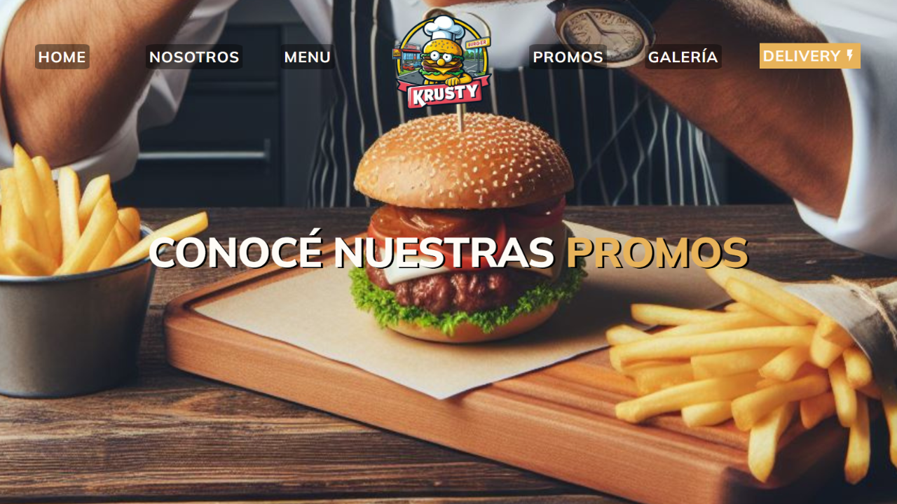

# 🍔 Krusty Burgers

¡Bienvenido a **Krusty Burgers**!

👉 **[Ver la demo en producción](https://krustyburgers.netlify.app)**

Una aplicación web que simula una página para una hamburguesería ficticia. Ofrece un diseño atractivo, navegación fluida y una interfaz simple que presenta productos y secciones informativas.

## 📖 Descripción
Este proyecto fue desarrollado en **JavaScript con React**, utilizando componentes reutilizables, rutas y diseño responsivo.  

## 🛠️ Tecnologías utilizadas
- React
- JavaScript
- React Router
- HTML5 & CSS3

## 🔍 Características
- Página de inicio con presentación del local
- Sección de productos tipo menú
- Información adicional como contacto y ubicación
- Navegación con rutas
- Diseño responsivo

## 📷 Capturas de pantalla






## 🚀 Cómo ejecutar el proyecto
1. Clonar este repositorio:
   ```sh
   git clone https://github.com/Gherex/KrustyBurgers.git
   ```
2. Instalar las dependencias:
   ```sh
   npm install
   ```
3. Ejecutar la aplicación:
   ```sh
   npm run dev
   ```
4. Abrí el navegador en: http://localhost:5173

## 💡 Nota
Este proyecto fue desarrollado con fines prácticos y de aprendizaje. No incluye funcionalidades reales de pedidos ni backend asociado.

## ✍️ Autor
**Germán Lagger**  
- [GitHub](https://github.com/Gherex)
- [LinkedIn](https://www.linkedin.com/in/germanlagger/)
